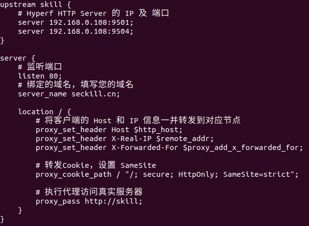
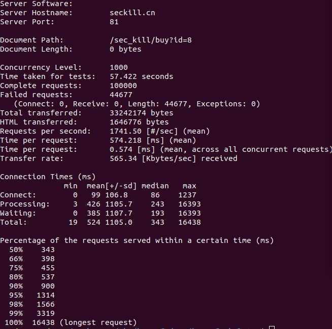
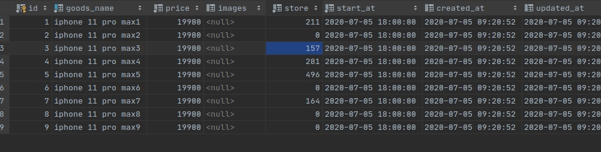

# Introduction
秒杀系统api,基于Hyperf研发，使用了Jwt,RabbitMq,redis
# Requirements
 - PHP >= 7.2
 - Swoole PHP extension >= 4.4，and Disabled `Short Name`
 - OpenSSL PHP extension
 - JSON PHP extension
 - PDO PHP extension （If you need to use MySQL Client）
 - Redis PHP extension （If you need to use Redis Client）
 - Protobuf PHP extension （If you need to use gRPC Server of Client）
# Installation using Composer
$ cd path/to/install
$ php bin/hyperf.php start
$ php bin/hyperf.php migrate
$ php bin/hyperf.php db:seed
This will start the cli-server on port `9501`, and bind it to all network interfaces. You can then visit the site at `http://localhost:9501/`

##压测准备
先通过postman 调用/sec_kill/setStore?id=8 将秒杀商品个数压人到list。
##高并发测试
通过nginx负载均衡两台服务，

通过ab压力测试 ab -n 100000 -c 1000 http://seckill.cn:81/sec_kill/buy?id=8

查看数据库有没有超卖

注：解决超卖是通过redis 锁 (set lock true ex 5 nx)解决并发和rpush、lpop解决超卖。set解决重复购买 ,做压力测试是注释掉了jwt认证中间件
